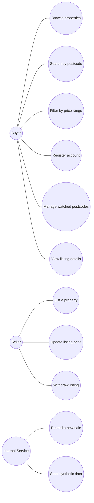
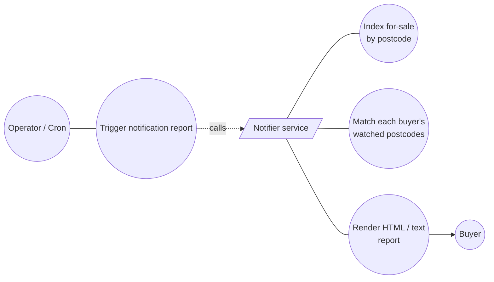
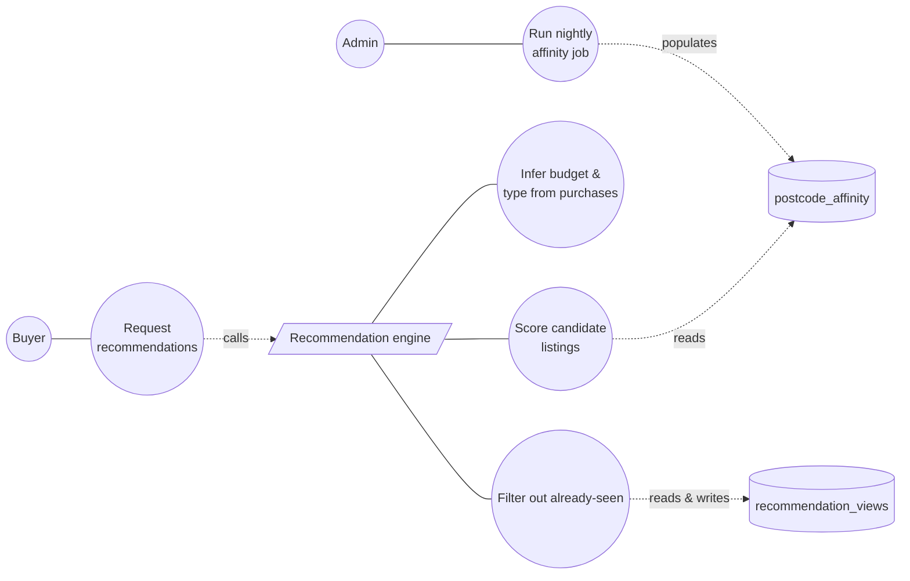

# Exercise 3 — Use Cases & Recommendation Engine Design

## 1. Recommendation Engine — MVP design

### What it recommends

For each registered buyer, the engine returns up to **N (default 10) ranked
listings the buyer hasn't seen yet** that are most likely to interest them.
Rather than guess in a vacuum, the MVP leans on three signals the system
already collects or can easily start collecting:

1. **Postcode interest** — the buyer's watched postcodes (existing on the
   `accounts` doc).
2. **Past purchases** — historical buys recorded in the `purchases`
   collection (`aid`, `pid`, `date`). For a buyer with prior purchases,
   we infer a budget band (median ± 25%) and a property-type preference
   from those rows.
3. **Postcode co-interest** — buyers in the same postcode tend to be
   interested in adjacent postcodes. A nightly batch job materialises a
   `postcode_affinity` collection of `{postcode_a, postcode_b, score}`
   tuples by counting how often watchers of A also watch B.

### Scoring

A candidate listing's score is a weighted sum:

```
score = 1.0 · (postcode_match)
      + 0.5 · (postcode_affinity_match)
      + 0.7 · (within_budget_band)
      + 0.3 · (matches_preferred_property_type)
      - 0.4 · (penalty_if_buyer_already_purchased)
```

We sort candidates descending by score and return the top N. A listing has
to score > 0 to be returned.

### Required additions to the system

| Need | What to build |
|---|---|
| Engine endpoint | `GET /recommend/{purchaserID}?n=10` returning a ranked list of listings + score + reason |
| Budget + type inference | One aggregation pipeline over `purchases ⋈ properties`, computed on demand and cached per-buyer |
| Postcode affinity | New `postcode_affinity` collection populated by a scheduled batch job (Mongo aggregation across `accounts.postcodes`) |
| Seen/unseen tracking | New `recommendation_views` collection (`{aid, listing_id, shown_at}`) so we don't re-recommend the same listing on every call |
| Cold start (no purchases) | Fall back to "score = postcode_match only" — i.e., the notifier output, but ranked by recency of listing |

### MVP scope vs. v1

The MVP is **synchronous, on-demand, no learning**: each `/recommend` call
recomputes from current data. That's fine up to ~10K buyers and 1K
listings. v1 would add precomputed recommendation rows in a
`recommendations` collection, refreshed by a nightly job, and an
implicit-feedback loop (click-through, save-to-favourites) to tune the
weights without a full ML stack.

---

## 2. Use Case Diagrams

### 2.1 Real Estate Server (core)



### 2.2 Notification System



Trigger today is the `GET /notify` endpoint. In production it would be
scheduled (cron) and the output would be emailed / queued per-buyer
instead of returned as one report.

### 2.3 Recommendation Engine (proposed)



### 2.4 Actors at a glance

| Actor | Role |
|---|---|
| **Buyer** | A registered `account_type = "Buyer"`. Browses listings, watches postcodes, requests recommendations. |
| **Seller** | Future role. Lists their property and adjusts price. Today the API exposes the same endpoints without auth. |
| **Internal Service / Admin** | Operates seed jobs, runs the notification cron, scheduled affinity recompute. |
| **Notifier service** | System component (not a person). Triggered by `/notify`; reads listings + accounts + properties; emits a report. |
| **Recommendation engine** | System component (proposed). Triggered by `/recommend/{id}`; reads multiple collections; emits a ranked list. |

---

## 3. Notes for the demo

- The notifier endpoint is **`GET /notify`** (HTML by default, `?format=text` for plain text — the brief calls out that the report could be large, so the plain-text option is the bulk-friendly path).
- The accompanying test suite is **`notify.NotifyServiceTest`** with seven cases covering: multi-postcode matching, unmatched postcodes, empty postcode list, null postcode list, empty index, independent purchaser matches, and field fidelity. Run with `mvn test` from the `REServer/` directory.
- The recommendation engine is **proposed** — not implemented this exercise.
